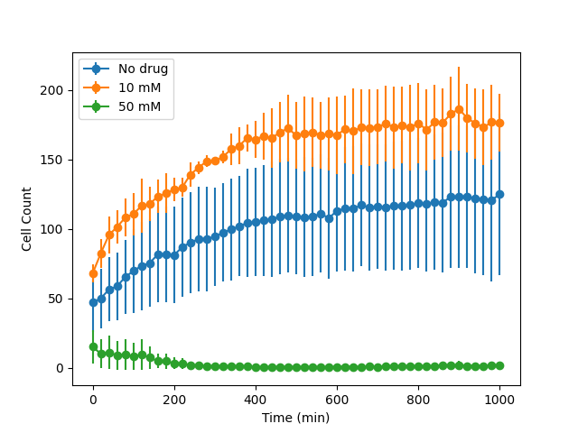

# Homework 02 - Plotting in Python

## Due 2024-09-12 at 11:59pm

In this assignment you'll get more familiar with reading files and working with lists and learn the basics of [matplotlib](http://matplotlib.org/), a powerful and high-quality graphing library. The goal is to plot changes in cell counts over time under different conditions. All the input and output files used in the assignment can be found in the [files directory](files/) of this repository.  If you aren't getting identical images to the solution, you can compare your output to these images using an [image comparison tool](https://www.diffchecker.com/image-compare/).  

Note the expectation is that you will generate an identical graph to the provided outputs. You should be able to achieve this by sticking with matplotlib defaults unless otherwise specified. If you have a solution that looks identical to the output but the grading script thinks it is different, let me know. Import matplotlib like this:

```python
import matplotlib
matplotlib.use('Agg')
import matplotlib.pyplot as plt
```

This will prevent matplotlib from trying to open a display, which it does by default, even if you don't see it.


## Arguments
Just like with your bash script, your python script will take commandline arguments. These are available in `sys.argv`:

```python
import sys
sys.argv # this is a list of the commandline arguments
```

The first element of this `list` (index 0) is the name of the script, so the first argument is at index 1.


## 60% Credit
You will create a python script, `assign.py`, that takes exactly two arguments, an input and output file:

`./assign.py in.0 out0.60.png`  

The input file has a header that specifies the name of the data followed by rows of x, y data like this:

```
No drug
0,72
20,71
40,77
60,76
80,84
100,93
120,99
140,93
160,103
```

Your script will plot this data using a line and circle style and save the result to the output file (`out0.60.png` in this example).


## 70% Credit
Add axis labels and a [legend](https://matplotlib.org/stable/api/_as_gen/matplotlib.pyplot.legend.html#matplotlib.pyplot.legend). The legend should be positioned in the "best" position as determined by matplotlib. The data is labeled according to the header value provided in the input file.


## 80% Credit
Modify your script to take two input files and plot both as separate data series (the third argument is the name of the output file).


## 90% Credit
Modify your script to take an arbitrary number of input files (the last argument is the name of the output file).

`./assign.py in.0 in.1 in.2 out0.90.png`


## 95% Credit
Modify your script so that each input file may have an arbitrary (but fixed) number of columns (representing different replicates of the same experiment):

```
No drug
0,72,39,16,62
20,71,45,17,67
40,77,51,21,77
60,76,51,23,85
80,84,56,27,95
100,93,56,27,103
120,99,55,31,109
140,93,55,37,117
160,103,56,41,127
```

You should plot the average (mean) of these values for each time point:


## 100% Credit
In addition to plotting the mean, plot the standard deviation with errorbars ([hint](http://docs.scipy.org/doc/numpy/reference/generated/numpy.std.html)).




Figures must match exactly to get credit at each step. You may want to check your script at each partial credit stage before implementing the next step, so if your images start to deviate from the reference images you'll know what code is responsible.